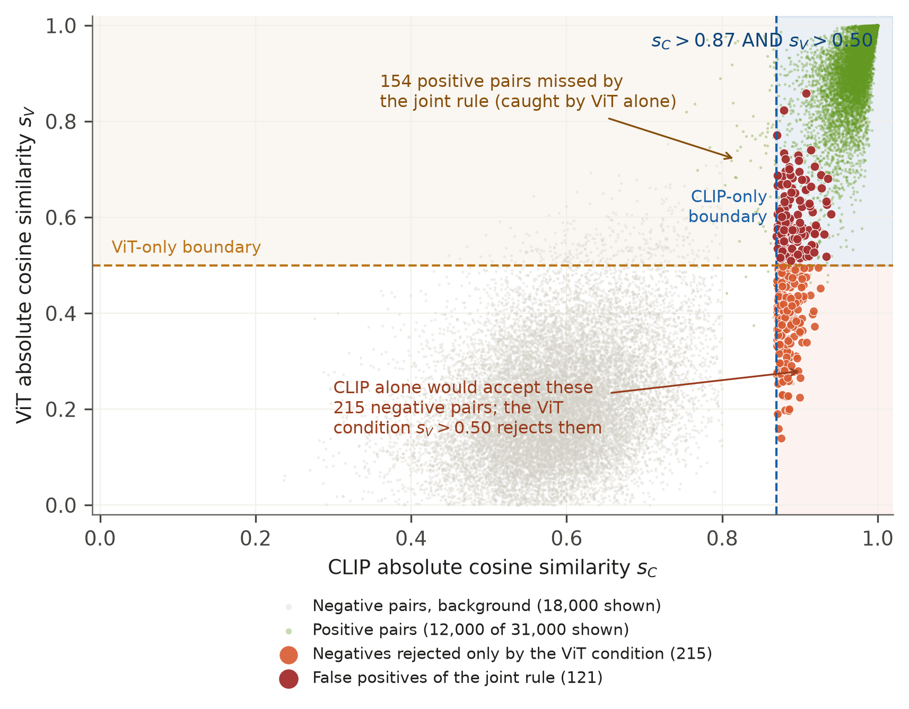

# Artwork Similarity Research

**Image transformation benchmarks, CLIP + ViT verification, and artwork registration prototypes.**

[中文说明](README.zh-CN.md) · [完整工作总览](docs/WORK_OVERVIEW.zh-CN.md) · [Reproduction guide](docs/REPRODUCIBILITY.md) · [Experiment protocols](docs/PROTOCOLS.md)

This repository brings together the research workflow from dataset preparation to similarity evaluation and application prototypes. It includes 12 image operations, seven similarity methods, threshold sweeps across several image domains, decision-rule comparisons, error analysis, runtime measurements, reusable feature extraction, and a static artwork-registration interface.

The main verification rule evaluates **both models on every image pair**:

```text
similar = (CLIP cosine similarity > 0.87) AND (ViT cosine similarity > 0.50)
```

CLIP uses `openai/clip-vit-base-patch32` projected image features (512 dimensions). ViT uses the CLS token of `google/vit-base-patch16-224` (768 dimensions). Both feature vectors are L2-normalized. The historical experiments use pretrained models; this release does not introduce model training.



Existing ArtBench-1K visualization using absolute scores; its joint counts at this operating point match the signed-score experiment.

## Work included

| Area | Implementation and evidence |
| --- | --- |
| Data preparation | Open Images, ArtBench/WikiArt and Pixiv collection scripts; image validation and supplementation |
| Transformation benchmarks | 12 operations; 32 single-operation variants; 793 combinations of one to four operations |
| Similarity methods | CLIP, ViT, aHash, pHash, dHash, wHash and PDQ |
| Threshold experiments | Early diagnostic experiments, fallback strategies, and 10,201-point joint-rule sweeps |
| Cross-dataset threshold selection | High-performance-region weighting and the shared `(0.87, 0.50)` operating point |
| Comparisons and diagnostics | AND, OR, CLIP-only and ViT-only; false-positive/false-negative export; plots and runtime records |
| Applications | Reusable vector extraction, folder comparison, a historical Flask API and a browser interaction prototype |

## Recorded results

Each of the following evaluations uses 1,000 originals, 31,000 original–transformation positive pairs and 499,500 unordered original–original negative pairs. Vertical flips (`F2`) are generated but excluded from the positive-pair protocol.

| Dataset label in this workspace | CLIP threshold | ViT threshold | TP | FP | FN | F1 |
| --- | ---: | ---: | ---: | ---: | ---: | ---: |
| ArtBench-1K / `Datasets5`, shared threshold | 0.87 | 0.50 | 30,779 | 121 | 221 | 0.994475 |
| WikiArt-1K / `Datasets6`, shared threshold | 0.87 | 0.50 | 30,770 | 225 | 230 | 0.992661 |
| Pixiv-1K, its own sweep optimum | 0.96 | 0.76 | 28,613 | 761 | 2,387 | 0.947858 |

These are evaluations of the recorded pairs. The sweeps select thresholds on those same pair sets; they are not held-out-test estimates. Pixiv's own optimum is listed explicitly: applying the shared art-domain thresholds to Pixiv yields F1 = 0.364273. Dataset names follow the local research records; ArtBench and WikiArt collection scripts both use ArtBench URL metadata, so the labels alone do not establish dataset independence.

## Quick start: reproduce results without models

Use Python 3.11 or newer. The cached-score workflow needs only NumPy.

```bash
python -m venv .venv
source .venv/bin/activate
python -m pip install -r requirements.txt

python scripts/evaluate.py results/scores/artbench1k.npz
python scripts/evaluate.py results/scores/wikiart1k.npz
python scripts/sweep.py results/scores/pixiv1k.npz --output outputs/pixiv_sweep.csv
python -m unittest discover -s tests -v
```

`evaluate.py` reports AND, OR and both single-model baselines at the supplied thresholds. `sweep.py` reproduces the strict-AND sweep. Scores are signed cosine similarities by default; `--score-mode absolute` reproduces the later absolute-score analysis convention. [Protocol details](docs/PROTOCOLS.md) describe their differences.

Reproduce the threshold weighting from the existing presentation:

```bash
python scripts/select_threshold.py \
  results/reported/exp4/threshold_eval/full_sweep/threshold_sweep_summary.csv \
  results/reported/exp4/datasets6_sweep/threshold_sweep_summary.csv
```

The two high-performance regions contain 374 and 243 grid points with F1 > 0.99. Their normalized counts give weights of 0.606159 and 0.393841 and select `(0.87, 0.50)`.

## Work with your own images

```bash
python -m pip install -r requirements-inference.txt
python scripts/generate_transforms.py examples/synthetic.png outputs/transforms
python scripts/extract_vectors.py examples outputs/reference_vectors --recursive
python scripts/extract_vectors.py examples/synthetic.png outputs/query_vectors
python scripts/compare_vectors.py outputs/query_vectors outputs/reference_vectors \
  --output outputs/comparison.csv
```

The extractor downloads the public model identifiers on first use. To use local weights, pass `--clip-model models/clip-vit-base-patch32 --vit-model models/vit-base-patch16-224`. See the [reproduction guide](docs/REPRODUCIBILITY.md) for artifacts, model revisions, and the limits of the legacy scripts.

## Repository layout

```text
scripts/             Portable entry points for scores, transforms and vectors
results/scores/      Three compact numeric score archives; no artwork images
results/reported/    Original sweep tables and selected historical summaries
research/            Preserved research scripts in their original relative layout
prototype/           Existing browser interaction prototype and its PRD
examples/            Generated geometric image for demonstration and smoke tests
configs/             Explicit reference protocol metadata
docs/                Work map, provenance, protocols, figure index and verification
tests/               Regression and decision-boundary checks
```

The `scripts/` entry points were assembled for this release from the existing work. `research/` retains the experiment history, including duplicate files whose original locations matter. Its scripts require the original data/model layout and are not all standalone commands; [the source guide](docs/SOURCE_GUIDE.md) records their roles and known dependencies.

The static prototype can be opened at [`prototype/index.html`](prototype/index.html). Its built-in example triggers the simulated failure path, and uploading a local image triggers simulated success. It does not call the Flask service. The historical API lives at [`research/app.py`](research/app.py); production registration, DID verification and blockchain services are design concepts, not implemented services in this release.

## Data, provenance and licensing

Raw datasets, transformed artwork images, model weights, presentation binaries, manuscript drafts and downloaded third-party papers are excluded from this package. The included numeric score archives allow the decision stage to be reproduced offline. Source hashes, copy adjustments and score derivation are recorded in [`docs/source_manifest.json`](docs/source_manifest.json) and [`docs/score_provenance.json`](docs/score_provenance.json).

No new license has been assigned to the project author's code. Existing third-party notices are preserved; see [THIRD_PARTY_NOTICES.md](THIRD_PARTY_NOTICES.md). The authors can add a project license at any time. Validation performed for this package is listed in [docs/VALIDATION.md](docs/VALIDATION.md).
