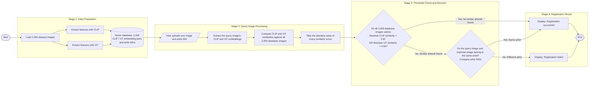

# Image Registration Experiment Workflow

Equivalently, no database image may simultaneously satisfy `|CLIP similarity| >= 0.87` and `|ViT similarity| >= 0.50`.

If a similar artwork is found, compare the artist DIDs: registration succeeds for the same artist and fails for a different artist.
